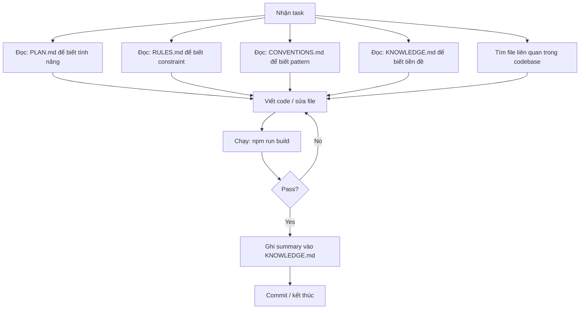

# AI Agent Guide

> Hướng dẫn cho AI agent khi làm việc với project JP-Learn.
> Đọc file này TRƯỚC KHI thực hiện bất kỳ task nào.

---

## 1. Bắt đầu task



## 2. Trước khi code — phải kiểm tra

- [ ] **Check `docs/PLAN.md`** — chức năng này đã được định nghĩa chưa? Phase nào?
- [ ] **Check `docs/RULES.md`** — có rule nào ảnh hưởng đến task này không?
- [ ] **Check `docs/KNOWLEDGE.md`** — xem tiền đề đã làm trước đó
- [ ] **Check `docs/CONVENTIONS.md`** — naming, imports, component patterns
- [ ] **Check `docs/ARCHITECTURE.md`** — data flow, component placement
- [ ] **Check `docs/DESIGN.md`** — colors, spacing, component styling
- [ ] **Check `docs/CONVENTIONS.md#5-styling`** — design token classes, radius rules
- [ ] **Read files liên quan** trong `src/` để hiểu code hiện tại
- [ ] **Check file structure** trong feature folder — có file nào có thể tái sử dụng không?

## 3. Khi code — phải tuân theo

### 3.1 Component placement

| Component type | Location |
|---------------|----------|
| shadcn/ui components | `components/ui/` — add via `npx shadcn@latest add` |
| Feature-specific | `components/<feature>/` |
| Shared (RoleGuard, ErrorBoundary) | `components/shared/` |
| Page-level | `app/<route>/page.tsx` |
| Server-only logic | `lib/` or colocated in `app/` |

### 3.2 Hook placement

| Hook type | Location |
|-----------|----------|
| TanStack Query hooks | `hooks/use-<feature>.ts` |
| Zustand stores | `hooks/use-<feature>.ts` (cùng file với query hooks nếu liên quan) |
| Generic hooks (use-debounce, use-keyboard) | `hooks/use-<name>.ts` |

### 3.3 Lib placement

| Lib | Location |
|-----|----------|
| Supabase clients | `lib/supabase/client.ts`, `server.ts`, `admin.ts` |
| Zod schemas | `lib/validations.ts` — 1 file, all schemas |
| Business logic (SM-2, XP) | `lib/<name>.ts` |
| Utils (cn) | `lib/utils.ts` |

### 3.4 Import pattern

```typescript
// Absolute imports with @/ alias
import { Button } from '@/components/ui/button'
import { useSets } from '@/hooks/use-sets'
import { cn } from '@/lib/utils'

// Relative imports only within same feature group
import { SetCard } from './set-card'
```

### 3.5 Database operations

```typescript
// READ — dùng trong Server Component
const supabase = await createClient()
const { data } = await supabase.from('sets').select('*').eq('is_public', true)

// MUTATE — dùng trong Server Action
'use server'
export async function createSet(formData: FormData) {
  const supabase = await createClient() // server
  const { data: { user } } = await supabase.auth.getUser()
  // ... Zod validate → insert
}
```

## 4. Khi sửa bug — workflow

```bash
# 1. Understand the bug
# 2. Find relevant files
# 3. Reproduce (nếu có thể)
# 4. Read current code + understand intent
# 5. Fix
# 6. Verify: npm run build
# 7. Nếu có test: npm run test
```

## 5. Khi thêm tính năng mới — workflow

```bash
# 1. Check PLAN.md — feature ở phase nào?
# 2. Check DB schema — table/column đã có chưa?
# 3. Nếu cần table mới → add to plan + tạo migration
# 4. Tạo Zod schema trong lib/validations.ts
# 5. Tạo supabase query hooks trong hooks/
# 6. Tạo components trong components/<feature>/
# 7. Tạo page trong app/<route>/
# 8. Add RLS policy nếu cần
# 9. npm run build
```

## 6. Các lệnh thường dùng

| Command | Purpose |
|---------|---------|
| `npm run dev` | Start dev server |
| `npm run build` | Build + type check (chạy TRƯỚC KHI commit) |
| `npm run lint` | ESLint |
| `npx shadcn@latest add <component>` | Add shadcn component |
| `npm run test` | Run tests |

## 7. Edge cases phải luôn xử lý

- **Loading state**: khi fetch data, luôn show skeleton (`<Skeleton>` from shadcn). Tạo `loading.tsx` cho mỗi route segment có list/grid data
- **Empty state**: "No sets yet. Create your first set!"
- **Error state**: toast + fallback UI, không crash page
- **Unauthenticated**: redirect to `/auth/login` với return URL
- **Forbidden (role)**: show "You don't have permission" + redirect
- **Not found**: 404 page or toast + redirect
- **Optimistic update failure**: rollback + toast error
- **Slow network**: disable button during mutation, show spinner
- **Mobile**: touch targets >= 44px, bottom navigation, swipe gestures

## 8. Checklist trước khi hoàn thành task

- [ ] Code follows `docs/CONVENTIONS.md` (naming, imports, patterns)
- [ ] Code follows `docs/RULES.md` (auth check, Zod validation, RLS)
- [ ] `npm run build` passes (no type errors, no lint errors)
- [ ] Loading / empty / error states handled
- [ ] Auth check in Server Action (nếu cần)
- [ ] Responsive trên mobile (test với responsive mode)
- [ ] Keyboard accessible (tab, enter, escape)
- [ ] Không có hardcoded secrets / keys
- [ ] Không có console.log / debug code
- [ ] **Ghi summary vào `docs/KNOWLEDGE.md`** — 1 đoạn ngắn: đã làm gì, tại sao, kết quả
